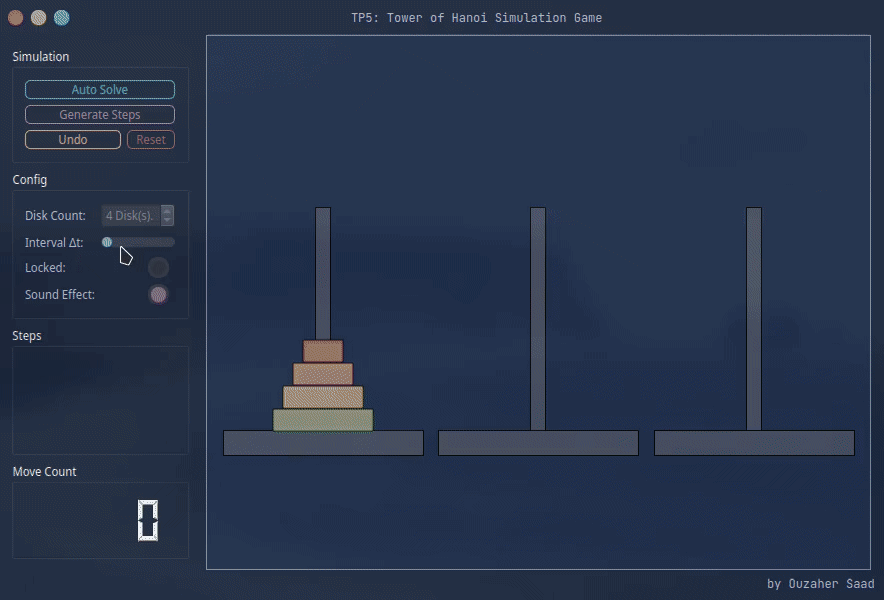

# QtHanoi
<p align="center">
  
</p>
<p align="center">
    TP5: Tower Of Hanoi
</p>

QtHanoi is a slick &amp; modern cross-platform graphical implementation of the recursive solution to the [Tower of Hanoi]("https://en.wikipedia.org/wiki/Tower_of_Hanoi") game written in C++ using the [Qt]("https://www.qt.io") Framework.
This implementation exposes two main interfaces. A `Game` interface which provides the necessary inputs/outputs to graphically play the game, and a `simulator`/`solver` interface that automatically determines a $2^n - 1$ steps solution to the given problem using the selected parameters, the `Hanoi::computeMoves` &amp;`Hanoi::autoHanoiSolver` methods to graphically solve it with an adjustable interval $\delta t$ between each step.

<p align="center">
  
</p>

# Pole Header
`Pole` QWidget
```c++
void initDisks(int);
Disk* popTop();
bool push(Disk*);
int getIndex();
int getDiskCount();
void paintEvent(QPaintEvent*);
```

# Disk Header
`Disk` QWidget
```c++
void Lift();
void setPolePos(Pole* d, int p);
int getSize();
Pole* getPole();
void paintEvent(QPaintEvent * event);
```

# Move Header
Enqueable Moves/Steps
```c++
int originPole();
int targetPole();
```

# Hanoi Header
`Hanoi` Class
```c++
// Private Members
void initPoles();
void adjustUi();
void toggleMaximized();
void connectSignalsAndSlots();
void autoHanoiSolver();
void toggleControls(bool);
void poleClickHandler(int);
void computeMoves(int, int, int, int);
void incrementStepCount(int);
void pushStep(int, int, int);
void toggleSettings(bool);
void resetGame();
// Private Callbacks
void fromPoleBtnCallback();
void auxPoleBtnCallback();
void toPoleBtnCallback();
void autoSolveBtnCallback();
void generateStepsCallback();
void undoMoveCallback();
// Private Slots
void spinBoxSlot(int);
void deltaTimeSliderSlot(int);
void lockedCheckBoxSlot(bool);
void sfxCheckBoxSlot(bool);
// Internal Event Overloading
void mousePressEvent(QMouseEvent*);
void mouseMoveEvent(QMouseEvent*);
void paintEvent(QPaintEvent*);
```


# Known Issues
+ Unlock controls on Reset
+ No sound on some systems
+ Disable horizontal scrollbar on stepsViewer

